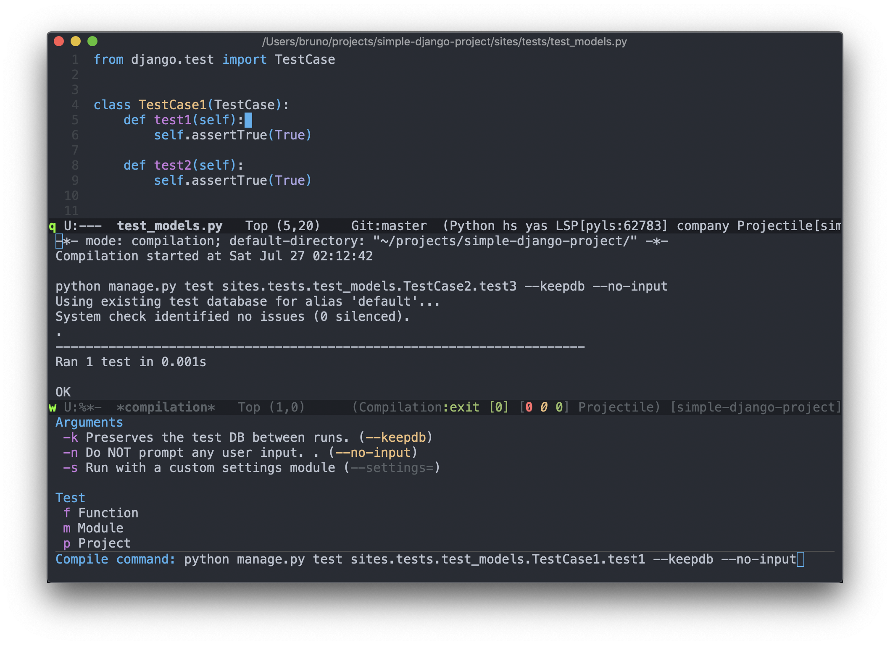

# django-test-runner.el

Quickly execute Django tests.



## What it does?

This package provides a function to generate commands to run specific Django tests. Invoke the function anywhere on the python file, and you'll have a test command for that file. When the cursor is at the class or method name, it generates a specific command for it. You can see it in use [here](https://streamable.com/hf593).

## Motivation
A quick feedback cycle is key for good and efficient development workflow. TDD helps with that, and this package aims to give you the necessary tooling when executing Django tests on Emacs.

## Quickstart

### Installation

``` emacs-lisp
(require 'django-test)
(define-key python-mode-map (kbd "<f10>") 'django-test-runner)
```

### Basic Usage
- On a Django test case, go to a class or method that you want to execute the tests.
- Invoke `django-test-runner` function.
- Choose the proper options on the pop-up. Press <kbd>RET</kbd>.
- Press <kbd>RET</kbd> again to accept `django-test-runner.el`  suggestion.

#### Notes
- The compile command is always executed with the `comint-mode`, unless `--no-input` option is selected. This behavior is required in case `manage.py` try to interact with you. `commint-mode` allows you to interact with the subprocess in case you need it.
- For a better experience, keep the `--no-input` always enabled and the `compile` will run without `comint-mode`. Now you can use `compilation-mode` keybind like  <kbd>g</kbd> (`recompile`), <kbd>M-g n</kbd> (`next-error`) and <kbd>M-g p</kbd> (`previous-error`) on `*compilation*` buffer.
- To save your command preferences, e.g. keep `--no-input` enabled by default, press  <kbd>C-x C-s</kbd> `(transient-save)` while the pop-up is open.

#### Extra tips
- Compilation mode does not scroll down the buffer window as the output appears by default. If you want this behavior you should:

``` emacs-lisp
(setq compilation-scroll-output t)
```
- It can be useful to automatically select `*compilation*` buffer when the command is executed. You can achieve this behavior by advising the `compile` command.

``` emacs-lisp
(defun follow-compilation (&rest args)
  (when (get-buffer "*compilation*")
    (switch-to-buffer-other-window "*compilation*")))

(advice-add 'compile :after follow-compilation)
```

More information about the Django test options can be found on [`Django documentation`](https://docs.djangoproject.com/en/2.2/ref/django-admin/).

## License

Distributed under the GNU General Public License, version 3.
